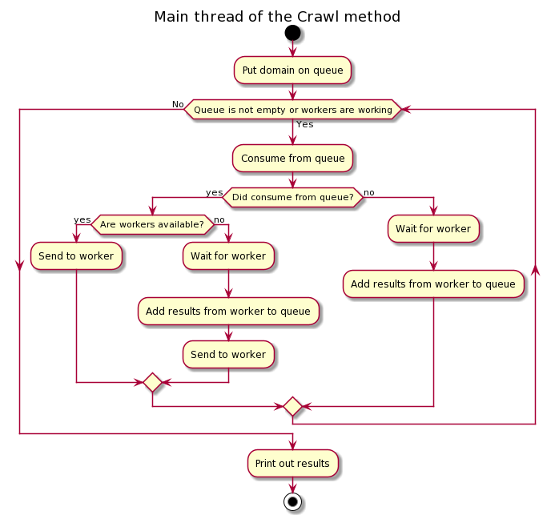
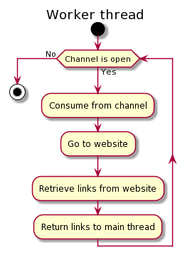

# Web crawler written in Go
This web crawler was written in Go 1.15.8.


This program crawles a target website to find all the websites. It does not scan any other domain than the one provided. It outputs data in the following format:
```
site [all space separated links found on this site]
othersite [all space separated links found on this other site]
```
For example:
```
http://example.com [http://example.com/1 http://example.com/2]
http://example.com/1 [http://example.com3]
```
This output shows that `http://example.com/1` and `http://example.com/2` were found on `http://example.com` and `http://example.com/3` was found on `http://example.com/1`.

It supports scanning with multiple goroutines. It uses a BFS algorithm to scan the site.

It works as follows:  



## How to use
> This will not work until the project has been made public!

First get the package with:
```
go get github.com/bkaznowski/webcrawler/cmd/webcrawler
```
Next run it with:
```
go run github.com/bkaznowski/webcrawler/cmd/webcrawler -target http://monzo.com -workers 10
```
You can see these options with the `-h` flag.
```
go run cmd/webcrawler/main.go -h
Usage of /tmp/go-build277890216/b001/exe/main:
  -target string
    	the target website
  -workers int
    	the number of workers (default 4)
```

## Assumptions
* We do not want to include links to external sites in the output
* We do not want to scan pages on the target domain that are on a different port
* The provided domain is correct

## Project structure
* `/dev/...` - contains useful resources for development
* `/cmd/...` - contains runnable main methods
* `/pkg/...` - contains the packages for web crawling

## Running the e2e tests


## Further work
* Add support for limiting
* Add retries
* Add support for ports (scanning example.com, example.com:81, example.com:82, etc.)
* If a link appears more than once on a page then it is output multiple times for that page
* Add timeouts
* Add user-agent for easy identification of this crawler
* Check for robots.txt file
* Proper automated e2e tests
* Add support for running it on multiple websites on the same instance concurrently

P.S.
The "according to the Charities Aid Foundation" link on https://monzo.com/blog/2019/05/09/giving-to-charity is not a valid link. It points to:
```
http://some%20of%20you%20donate%20your%20time%20instead%20%20%20%20https//twitter.com/DesignAganova/status/1124302061145866241%20%20%20https://twitter.com/DesignAganova/status/1124302061145866241%20%20%20https://twitter.com/JonesAlexM/status/1124308849287159808%20%20%20https://twitter.com/JonesAlexM/status/1124308849287159808"
```
